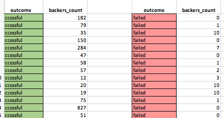

# Kickstarter
# Microsoft Excel Charting

## Background

Over $2 billion has been raised using the massively successful crowdfunding service, Kickstarter, but not every project has found success. Of the more than 300,000 projects launched on Kickstarter, only a third have made it through the funding process with a positive outcome.

Getting funded on Kickstarter requires meeting or exceeding the project's initial goal, so many organizations spend months looking through past projects in an attempt to discover some trick for finding success. Using the Excel data file in this repo, I will organize and analyze a database of 4,000 past projects in order to uncover any hidden trends.

* Using conditional formatting, I filled each cell in the `state` column with a different color, depending on whether the associated campaign was successful, failed, canceled, or is currently live.

* I created a new column called `Percent Funded` that uses a formula to uncover how much money a campaign made to reach its initial goal.

* Using conditional formatting, I filled each cell in the `Percent Funded` column using a three-color scale. The scale starts at 0 and has a dark shade of red, transitioning to green at 100, and then blue at 200.

* I created a new column called `Average Donation` that uses a formula to uncover how much each backer for the project paid on average.

* I created two new columns; one called `Category` and another called `Sub-Category`, by using a formula with each cell to split the `Category and Sub-Category` column into two parts.

* I created a new sheet with a pivot table analyzes the initial worksheet to count how many campaigns were successful, failed, canceled, or that are currently live, by **category**.

* I created a stacked column pivot chart that can be filtered by country based on the pivot table I created.

* I created a new sheet with a pivot table that analyzes the initial worksheet to count how many campaigns were successful, failed, or canceled, or are currently live, by **sub-category**.

* I created a stacked column pivot chart that can be filtered by country and parent-category based on the pivot table I created.

* The dates stored within the `deadline` and `launched_at` columns use Unix timestamps. [here](https://www.extendoffice.com/documents/excel/2473-excel-timestamp-to-date.html) I found a formula that I used to convert these timestamps into a normal date. I also created a new column named `Date Created Conversion` and `Date Ended Conversion` to hold these conversions. 

* I created a new sheet with a pivot table of `state`'s, and rows of `Date Created Conversion`. Here, values based on the count of `state`, and filters are based on `parent category` and `Years`.

* I created a pivot chart line graph that visualizes this new table.

* I created a report in Microsoft Word to answer a few follow up questions and to shed insight [click to open .docx file](QandA.docx).

* I created a new worksheet with 8 columns:

  * `Goal`
  * `Number Successful`
  * `Number Failed`
  * `Number Canceled`
  * `Total Projects`
  * `Percentage Successful`
  * `Percentage Failed`
  * `Percentage Canceled`

* In the `Goal` column, I created 12 rows with the following headers:

  * Less than 1000
  * 1000 to 4999
  * 5000 to 9999
  * 10000 to 14999
  * 15000 to 19999
  * 20000 to 24999
  * 25000 to 29999
  * 30000 to 34999
  * 35000 to 39999
  * 40000 to 44999
  * 45000 to 49999
  * Greater than or equal to 50000

* Using the `COUNTIFS()` formula, I counted how many successful, failed, and canceled projects were created with goals within the ranges listed above. I then populated the `Number Successful`, `Number Failed`, and `Number Canceled` columns with this data.

* I added up each of these values in the `Number Successful`, `Number Failed`, and `Number Canceled` columns to populate the `Total Projects` column. Then, using a mathematical formula, I found the percentage of projects that were successful, failed, or canceled per goal range.

* I created a line chart that graphs the relationship between a goal amount and its chances at success, failure, or cancellation.

## Statistical Analysis

If one were to describe a successful crowdfunding campaign, most people would use the number of campaign backers as a metric of success. One of the most efficient ways that data scientists characterize a quantitative metric, such as the number of campaign backers, is by creating a summary statistics table.

* In a new worksheet I created two columns; one for the number of backers of successful campaigns and another for unsuccessful campaigns.

* Using Excel I evaluated the following for successful campaigns, and then for unsuccessful campaigns:

  * The mean number of backers.

  * The median number of backers.

  * The minimum number of backers.

  * The maximum number of backers.

  * The variance of the number of backers.

  * The standard deviation of the number of backers.

* Trying to see if the mean or the median summarizes the data more meaningfully.

* Also trying to see the variability with successful or unsuccessful campaigns.

